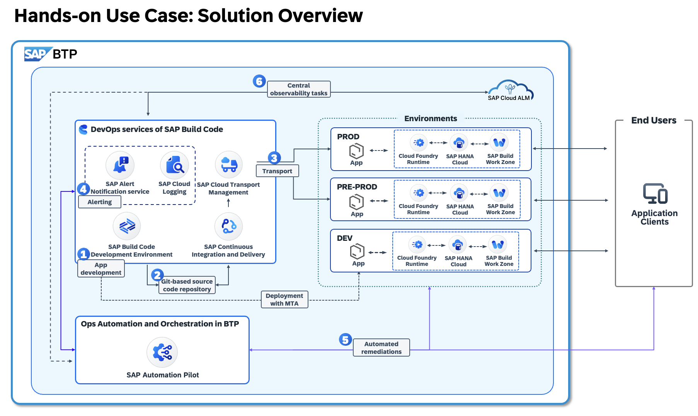

# DSAG TechXchange 2025 – Session H19: Leveraging GenAI in SAP Automation Pilot for Enhanced Operational Efficiency!

Welcome to our **on-site hands-on labn** on **Leveraging GenAI in SAP Automation Pilot for Enhanced Operational Efficiency**! 
This session is designed for **SAP partners, customers, and developers** who want to streamline their cloud application operations using **automation tools provided by SAP**.

## **Hands-on sessions covered during this session**

---

## **Hands-on sessions covered in this repo**

- Introduction to **SAP Automation Pilot** for automating **operational tasks and remediations**.
-  **Hands-on:**
  - Creating and testing **automation workflows** for common operational tasks.
  - Exploring potential **use cases** where SAP Automation Pilot adds value for Ops teams by leveraging built-in GenAI features
  - Extending SAP Automation Pilot built-in Content Generation Assistant by integrating it to SAP AI Core service

# Product in focus - SAP Automation Pilot 
The goal of SAP Automation Pilot is to simplify and automate complex manual technical processes and flows. This enables DevOps teams to run their solutions on SAP BTP with minimal operational effort.

## SAP Automation Pilot is a low-code / no-code automation engine that allows you to:
- Automate sequences of steps,
- Execute scripts in a serverless manner,
- Use catalogs of commands provided by SAP to automate typical Ops tasks in and outside your SAP BTP landscape,
- Build custom automations.

Automations in SAP Automation Pilot can be triggered in various ways to best fit your operational needs - manually by the DevOps team, through the built-in scheduler, automatically via integration with services and ops platforms like SAP Cloud ALM, or by other applications and systems.

The service is designed to work with low latency, even under a heavy workload, and is capable of triggering hundreds of automations simultaneously.

### ** SAP Build Code Overview **
- Introduction to **SAP Build Code** and how it accelerates application development.
- Key features and benefits for **SAP partners and customers**.
- **Hands-on:** Accessing our **SAP BTP Subaccount**, setting up **SAP Build Code** and **SAP Business Application Studio**.

---

### ** Cloud App Development with SAP Business Application Studio **
- Exploring how the **Cloud Application Programming (CAP) Model** simplifies and accelerates SAP development.
- Building **scalable, cloud-native applications** with best practices.
-  **Hands-on:** 
  - Setting up **SAP Business Application Studio (BAS)**.
  - Developing, testing, and deploying a **CAP-based** application on **SAP BTP**.
  - Using **Multitarget Application (MTA) Model** for structuring and deploying applications within **Cloud Foundry**.

---

### ** Seamless Software Delivery: Transport Management & CI/CD Pipelines on SAP BTP *
- Deep dive into **SAP Cloud Transport Management (cTMS)** and **SAP Continuous Integration & Delivery (CI/CD)**.
-  **Hands-on:** 
  - Configuring and executing a **CI/CD pipeline** for an SAP BTP application.
  - Integrating **cTMS** for centralized **control, tracking, and transport management**.

---

### ** Alert Notification Service for SAP BTP in Action **
- Introduction to **SAP Alert Notification Service**.
- Setting up **proactive alerting** and **incident management** for SAP BTP applications.
-  **Hands-on:** 
  - Consuming **events** and setting up **instant notifications** for cloud applications on SAP BTP.

---

---

## **Prerequisites to check the extended use case covering Business Applicaiton Studio **

✅ You have an **SAP BTP account** with access to **SAP Business Application Studio**.  
✅ You are familiar with **basic cloud development concepts** and **Git**.  
✅ You have installed the necessary **development tools** as shared in our pre-event checklist.

---

##  **Let's Build & Automate!**
This enablement day is **interactive and hands-on**, ensuring you gain **real-world experience** with SAP BTP DevOps tools. Get ready to **develop, deploy, and automate** like a pro!

 **For any questions or support, reach out to us during the event!**  
